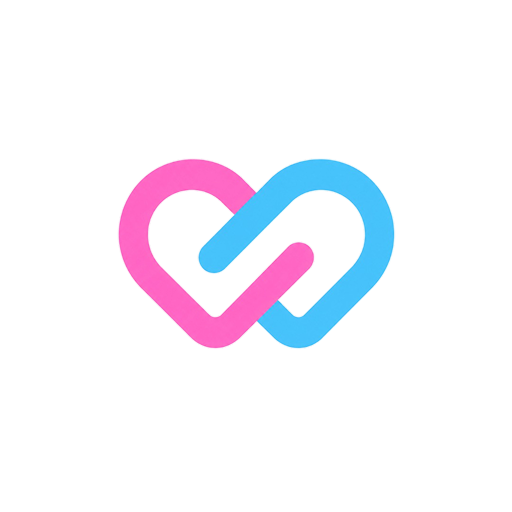
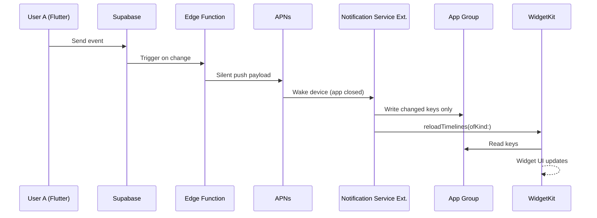

<p align="center">
  
</p>

<h1 align="center">Lovelynk</h1>

<p align="center">
  <strong>Stay connected across any distance — with a Flutter app and native iOS widgets.</strong>
</p>

<p align="center">
  <a href="https://flutter.dev"></a>
  <a href="https://dart.dev"></a>
  <a href="https://developer.apple.com/widgetkit/"></a>
  <a href="https://pub.dev/packages/get"></a>
  
  
</p>

<p align="center">
  Home & Lock Screen widgets · Real-time couple sync · Customisable themes · Subscription-ready
</p>

---

## Overview

**Lovelynk** is a long-distance couples app built with **Flutter** for the in-app experience and **native WidgetKit (SwiftUI)** for iOS Home Screen and Lock Screen widgets.

The app lets partners share distance, time together, weather, reactions, and more — surfaced both inside the app and on the device home screen, even when the app is closed (via push-driven widget updates).

| | |
|---|---|
| **Bundle ID** | `com.lovelynk.app` |
| **App Group** | `group.com.lovelynk.app` |
| **Min iOS** | 16.0 |
| **Architecture** | Flutter + GetX + WidgetKit Extension |

---

## Features

### In-app (Flutter)
- **Home** — partner connection status, distance preview, widget strip
- **Widgets catalog** — 12 widgets across Essentials, Relationship, and Interactive categories
- **Customise** — per-widget colours, backgrounds, fonts, and text sizes (live preview)
- **Interactive widgets** — Heartbeat, Kiss, and Emoji send flows
- **Subscriptions** — 7-day free trial, monthly & yearly plans, widget soft-lock
- **Profile & settings** — account, notifications, activity summaries

### Native iOS widgets (WidgetKit)
- Home Screen — Small & Medium families
- Lock Screen — Circular, Rectangular, and Inline accessories
- Shared **App Group** bridge between Flutter and Swift
- Subscription lock state synced to native tiles
- Customise styles applied per widget

---

## Widget catalog

| Category | Widget | In-app | Native iOS |
|----------|--------|:------:|:----------:|
| **Essentials** | Partner Distance | ✅ | ✅ |
| | Days Together | ✅ | ✅ |
| | Together Counter | ✅ | — |
| | Partner Time | ✅ | — |
| | Partner Weather | ✅ | — |
| | Next Visit Countdown | ✅ | — |
| **Relationship** | Love Compass | ✅ | — |
| | Initials | ✅ | ✅ |
| | Anniversary | ✅ | ✅ |
| **Interactive** | Heartbeat | ✅ | — |
| | Kiss | ✅ | — |
| | Emoji | ✅ | — |

> Native widgets live in `ios/LovelynkWidgets/`. See [Widget Setup Guide](docs/WIDGET_NATIVE_SETUP.md) for Xcode configuration.

---

## Architecture

### Flutter ↔ WidgetKit bridge

```text
┌─────────────────────┐         ┌──────────────────────────┐
│  Flutter App        │  write  │  App Group (UserDefaults) │
│  (GetX + Services)  │ ──────► │  group.com.lovelynk.app   │
└─────────────────────┘         │                          │
                                │  days_together_count = 76 │
┌─────────────────────┐  read   │  partner_distance_miles   │
│  Widget Extension   │ ◄────── │  widget_global_locked     │
│  (SwiftUI)          │         └──────────────────────────┘
└─────────────────────┘
```

| Layer | Responsibility |
|-------|----------------|
| `WidgetDataService` | Relationship data (Supabase-ready) |
| `WidgetStyleStore` | Customise persistence |
| `SubscriptionService` | Trial / premium / widget lock state |
| `WidgetSyncService` | App Group writes + `HomeWidget.updateWidget` |
| `LovelynkWidgets/` | Native SwiftUI timeline providers |

### Cross-user updates (app closed)

When User A triggers an event and User B's app is closed, widgets update via push — not Flutter:



---

## Tech stack

| Area | Technology |
|------|------------|
| UI Framework | Flutter 3.11+ |
| State & routing | GetX |
| Local storage | Hive, Flutter Secure Storage |
| Networking | Dio |
| iOS widgets | WidgetKit, SwiftUI, `home_widget` |
| Location / compass | Geolocator, Flutter Compass |
| Backend (planned) | Supabase + Edge Functions + APNs |

---

## Project structure

```text
lib/
├── app/
│   ├── core/
│   │   ├── services/          # Subscription, widget data, compass
│   │   └── widgets/           # App Group keys, sync service, styles
│   ├── data/
│   │   └── widget_catalog/    # 12 widget definitions
│   └── modules/
│       ├── home/              # Home screen
│       ├── widgets/           # Widget catalog UI
│       ├── color_customise/   # Customise screen
│       ├── subscriptions/     # Paywall
│       └── profile/           # Profile & settings
│
ios/
├── LovelynkWidgets/           # Native widget extension (SwiftUI)
│   ├── Shared/                # App Group store, keys, styles
│   └── Widgets/               # Per-widget Swift files
└── Runner/                    # Main iOS app target

docs/
└── WIDGET_NATIVE_SETUP.md     # Xcode & App Group setup guide
```

---

## Getting started

### Prerequisites

- Flutter SDK `^3.11.4`
- Xcode 15+ (for iOS widgets)
- CocoaPods
- Apple Developer account (for App Groups on device)

### Install & run

```bash
# Clone the repository
git clone <your-repo-url>
cd bulkretail

# Install dependencies
flutter pub get

# iOS pods
cd ios && pod install && cd ..

# Run on simulator or device
flutter run
```

### iOS widget extension (first-time)

Full checklist: **[docs/WIDGET_NATIVE_SETUP.md](docs/WIDGET_NATIVE_SETUP.md)**

Quick steps:

1. Register App Group `group.com.lovelynk.app` in Apple Developer portal
2. Open `ios/Runner.xcworkspace` in Xcode
3. Enable App Groups on **Runner** and **LovelynkWidgetsExtension** targets
4. Clean build → `flutter run`
5. Add widgets from the iOS widget gallery (Home or Lock Screen)

---

## Key services

```dart
// Central widget bridge — runs on app launch
Get.find<WidgetSyncService>().syncOnAppLaunch();

// Subscription state (single source of truth)
Get.find<SubscriptionService>().isPremium;        // paid only
Get.find<SubscriptionService>().isWidgetsUnlocked; // trial or paid

// Per-widget native refresh
Get.find<WidgetSyncService>().syncWidget(AppWidgetType.daysTogether);
```

---

## Roadmap

- [x] Flutter app shell (Home, Widgets, Customise, Profile)
- [x] 12-widget catalog with in-app previews
- [x] Native iOS widgets — Days Together, Initials, Partner Distance, Anniversary
- [x] App Group sync + subscription soft-lock
- [x] Subscription screen (trial + monthly/yearly)
- [ ] Supabase integration (auth, couple pairing, realtime)
- [ ] APNs + Notification Service Extension (push widget updates)
- [ ] Remaining 8 native widgets (timelines, weather, compass)
- [ ] StoreKit in-app purchases

---

## Documentation

| Doc | Description |
|-----|-------------|
| [Widget Native Setup](docs/WIDGET_NATIVE_SETUP.md) | Xcode, App Groups, troubleshooting |
| [Customise preview assets](assets/images/README_customise_preview.md) | Lock screen preview image notes |

---

## Development notes

- **Design size:** `360 × 690` (ScreenUtil)
- **Widget keys** are defined in `lib/app/core/widgets/widget_app_group.dart` and mirrored in `ios/LovelynkWidgets/Shared/WidgetKeys.swift` — keep them in sync
- **Native widget kinds** are mapped in `lib/app/core/widgets/widget_kind.dart`
- When subscription is locked, widget **data** is not synced; lock flags still are

---

## Author

Built with care for couples who refuse to let distance win.

<p align="center">
  <sub>Lovelynk · Flutter × WidgetKit · iOS 16+</sub>
</p>
