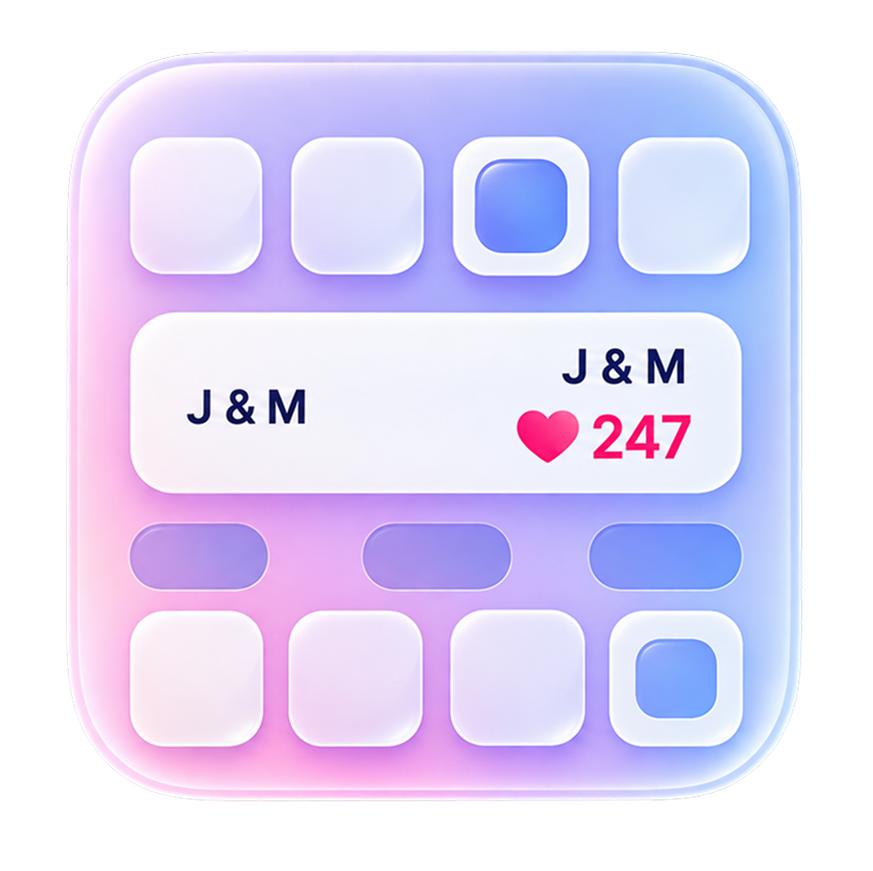
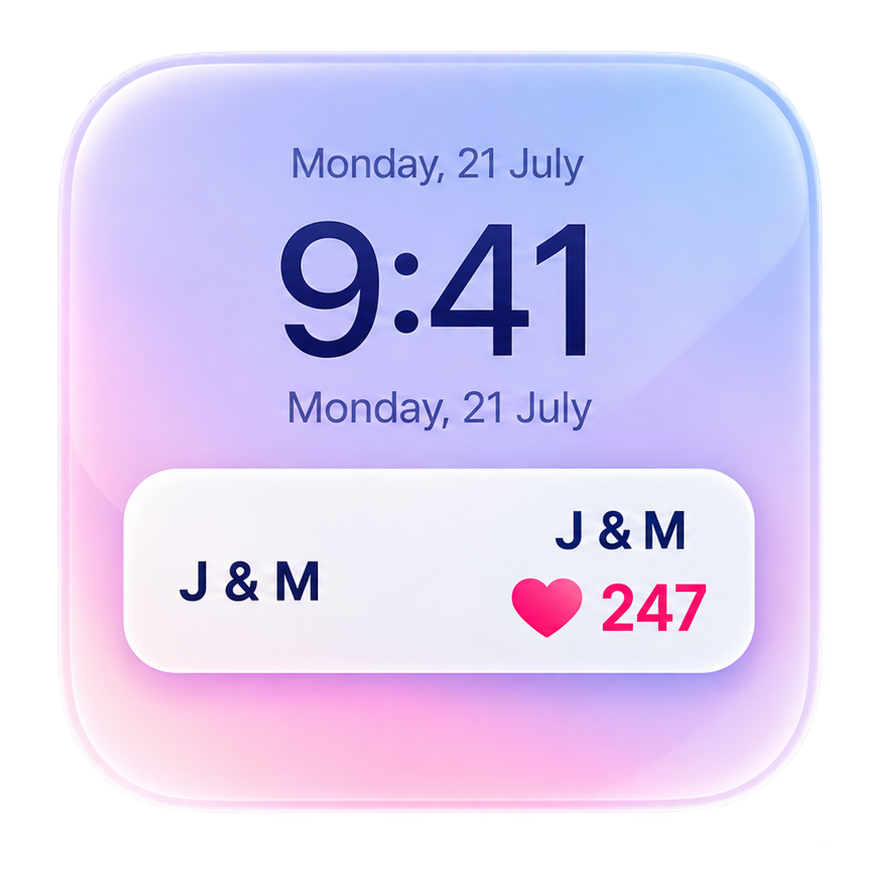
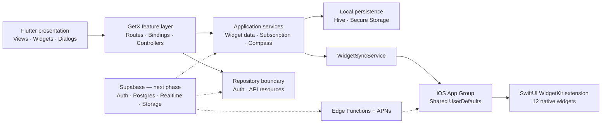
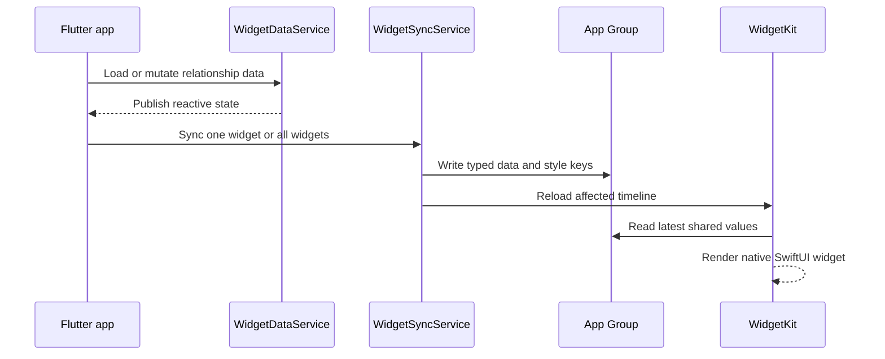
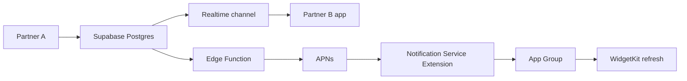

# Lovelynk

<p align="center">
  
</p>

<p align="center">
  <strong>A couples companion app that turns everyday relationship moments into expressive iOS Home and Lock Screen widgets.</strong>
</p>

<p align="center">
  
  
  
  
  
</p>

Lovelynk helps couples stay connected across distance through live relationship data, shared activities, interactive reactions, and 12 customizable native widgets. The Flutter application owns the product experience and business logic; a native SwiftUI extension renders efficient iOS widgets using data synchronized through an App Group.

> **Project status:** The mobile experience and native widget system are implemented. Data is currently driven by a centralized mock/local service, with clear integration seams prepared for Supabase, realtime events, authentication, storage, and push delivery.

## Product preview

<p align="center">
  
  &nbsp;&nbsp;
  
</p>

## What Lovelynk offers

- **12 native iOS widgets** across Home and Lock Screen families
- **Couples pairing flow** designed for two connected accounts
- **Live relationship utilities** such as distance, partner time, weather, compass direction, counters, and countdowns
- **Interactive moments** through Heartbeat, Kiss, and Emoji experiences
- **Widget personalization** for theme color, background, typography, and text sizing
- **Activity summaries** with sender-aware Heartbeat, Kiss, and Emoji history
- **Premium experience** with trial, plan selection, restore, and widget soft-lock UI
- **Responsive Flutter UI** with reusable components, animations, and guided widget setup

## Widget catalog

| Relationship | Utility | Interactive |
| --- | --- | --- |
| Days Together | Partner Distance | Heartbeat |
| Initials | Partner Time | Kiss |
| Anniversary | Partner Weather | Emoji |
| Together Counter | Love Compass |  |
| Next Visit Countdown |  |  |

Every widget has a native WidgetKit implementation. Supported families vary by design and include `.systemSmall`, `.systemMedium`, `.accessoryCircular`, `.accessoryRectangular`, and `.accessoryInline`.

## Architecture at a glance



### Architectural approach

The codebase uses a **feature-first, layered structure**:

1. **Presentation** — views and reusable UI compose the user experience.
2. **Feature orchestration** — GetX bindings create controllers and dependencies only where needed.
3. **Application services** — long-lived services hold shared reactive state and coordinate device capabilities.
4. **Repositories** — abstract external data access from controllers.
5. **Platform bridge** — `WidgetSyncService` maps application state into App Group keys and requests targeted WidgetKit reloads.
6. **Native extension** — SwiftUI widgets read only shared values and styles, keeping rendering independent from the Flutter runtime.

This split allows the mock data source to be replaced with Supabase without rewriting screens or native widget layouts.

## Widget synchronization



The App Group is the device-level contract between Flutter and WidgetKit. Each widget owns a distinct key namespace, while global subscription state controls widget soft-locking. For live timers, native layouts use timeline entries and system-aware rendering rather than depending on a running Flutter process.

## Project structure

```text
lib/
├── app/
│   ├── core/
│   │   ├── network/          # API client, endpoints, exception mapping
│   │   ├── services/         # Shared application/device services
│   │   ├── theme/            # Brand colors, gradients, and themes
│   │   └── widgets/          # Flutter ↔ WidgetKit bridge
│   ├── data/
│   │   ├── models/           # Domain and UI models
│   │   └── repositories/     # External-data boundaries
│   ├── global/               # Reusable layouts and UI primitives
│   ├── modules/              # Feature-first views/controllers/bindings
│   └── routes/               # Central GetX route registry
├── gen/                      # Generated asset references
└── main.dart                 # Bootstrap and permanent dependencies

ios/LovelynkWidgets/
├── Shared/                   # App Group, keys, styles, timers, layouts
├── Widgets/                  # One native SwiftUI implementation per widget
└── LovelynkWidgetBundle.swift
```

Representative feature modules include Home, Widgets, Customisation, Activities, Notifications, Profile, Subscriptions, Partner Connection, and the three interactive summary experiences.

## Technology

| Area | Implementation |
| --- | --- |
| Application | Flutter, Dart |
| State and navigation | GetX, route bindings, reactive controllers |
| Native widgets | Swift, SwiftUI, WidgetKit |
| Flutter/native bridge | `home_widget`, iOS App Group |
| Local persistence | Hive, Flutter Secure Storage |
| Device context | Geolocator, Flutter Compass |
| Networking foundation | Dio with repository abstractions |
| Responsive UI | Flutter ScreenUtil |
| Media and UI | Flutter SVG, cached images, emoji picker, animations |
| Planned backend | Supabase Auth, Postgres, Realtime, Storage, Edge Functions |

## Key engineering decisions

- **Single source of widget truth:** `WidgetDataService` exposes the relationship snapshot and interactive activity streams.
- **Backend-ready seam:** `refreshFromBackend()` is intentionally isolated so remote data can replace seeded data cleanly.
- **Targeted native updates:** Widget kinds and App Group keys are centrally mapped to avoid coupling feature screens to Swift code.
- **Shared style contract:** Flutter persists customization values; Swift reads the same values through `WidgetStyleConfig`.
- **Native-first widget rendering:** Home and Lock Screen widgets remain useful when Flutter is suspended.
- **Feature-level dependency injection:** bindings keep controller lifecycles explicit and testable.
- **Subscription-aware widgets:** one global shared flag controls native soft-lock behavior consistently.

## Supabase roadmap

The next implementation phase will make the current product shell fully multi-user and realtime:

- [ ] Supabase email/social authentication and secure session restoration
- [ ] Invite-code or deep-link partner pairing
- [ ] Row Level Security policies scoped to each couple
- [ ] Relationship profile, important dates, location, weather, and activity tables
- [ ] Realtime subscriptions for Heartbeat, Kiss, Emoji, and partner state
- [ ] Storage buckets for avatars and shared media
- [ ] Edge Functions for server-owned workflows
- [ ] APNs delivery and a Notification Service Extension for background widget updates
- [ ] StoreKit-backed subscription purchase, restore, and entitlement validation
- [ ] Repository, service, widget, and integration test coverage

### Planned realtime path



Row Level Security will be the authorization boundary: both users may access their shared couple record, while unrelated accounts cannot read or mutate it.

## Running locally

### Prerequisites

- Flutter SDK compatible with Dart `^3.11.4`
- Xcode with iOS 16+ SDK
- CocoaPods
- An Apple signing team for running the Widget Extension on a physical device

### Flutter app

```bash
git clone https://github.com/mosharof00/Lovelynk.git
cd Lovelynk
flutter pub get
flutter run
```

### iOS widgets

```bash
cd ios
pod install
open Runner.xcworkspace
```

In Xcode, assign signing to both **Runner** and **LovelynkWidgetsExtension**, then enable this App Group on both targets:

```text
group.com.lovelynk.ios
```

Run the app once before adding widgets so Flutter can populate the shared store. For the complete native setup and troubleshooting guide, see [`docs/WIDGET_NATIVE_SETUP.md`](docs/WIDGET_NATIVE_SETUP.md).

## Quality checks

```bash
flutter analyze
flutter test
```

The repository is currently transitioning from a UI/native-widget prototype to production infrastructure. Expanding automated coverage is part of the backend phase; the existing default smoke test should not be interpreted as comprehensive coverage.

## Current boundaries

- Native Home and Lock Screen widgets are currently **iOS-only**.
- Relationship values and interactive events are currently local/demo data.
- Subscription actions provide the product flow but still require StoreKit integration.
- Background remote updates require Supabase, APNs, and a Notification Service Extension.

These boundaries are explicit architectural milestones—not hidden production claims.

---

<p align="center">
  Built as a cross-platform Flutter product with a native iOS widget architecture.
</p>
