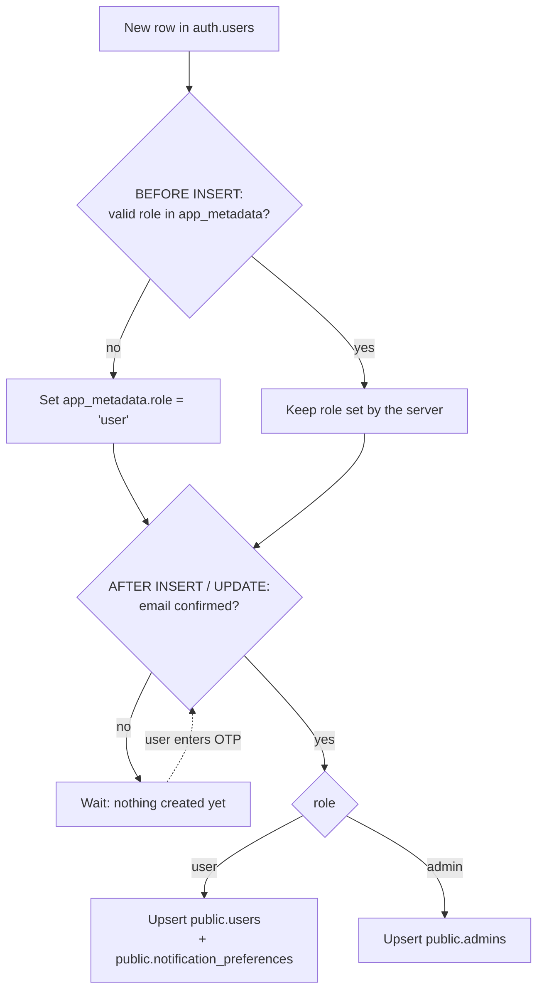
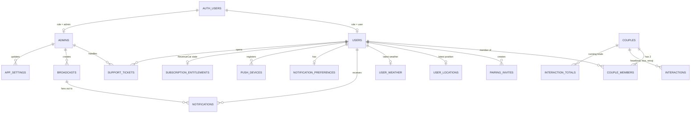

# Lovelynk — Database Schema Plan (Phase 3)

> Status: **v3 — Phase A (database structure) applied** on 7 Oct 2026 (13 migrations in `supabase/migrations/`, advisors clean, RLS tested). Phases B–D pending. v3 adds OTP email verification, the seed admin, subscription prices and revenue, and the split into phases (section 16).
>
> Supabase project: `LoveLynk` (`yvfolpaqchdmqdluprpo`), region `eu-west-1`, Postgres 17. Current state: no auth users, no tables, no buckets.

---

## 1. Goals and principles

1. **Two roles: `user` and `admin`.** The role lives in `auth.users.raw_app_meta_data.role`, which only the server can write. Mobile users get a row in `public.users`; admins get a row in `public.admins`. One account is never both.
2. **Couple-first data model.** Everything shared (dates, interactions, premium access) hangs off a `couple`. A user belongs to at most one active couple.
3. **Row Level Security on every table.** Users see their own rows and their active partner's rows. Admins see what the admin panel needs, and **no more**: no precise locations, no individual heartbeats/kisses/emojis, no private notifications.
4. **No privileged key in any client.** The mobile app and the Next.js admin panel both use the publishable key plus the signed-in user's session. Privileged actions (ban, delete account, create admin, RevenueCat webhook, push sending, weather API) run in Edge Functions with server-side secrets.
5. **Sensitive changes go through RPCs** that validate and rate-limit.
6. **Every change is a migration**, applied through MCP and mirrored in `supabase/migrations/`.
7. **Cost-aware by design.** The dashboard reads pre-aggregated daily metrics instead of counting large tables. Realtime is used only where a user is waiting on screen for something.
8. **Privacy by default (UK GDPR).** Precise location is latest-only and partner-only. Detailed interaction history is kept for 90 days. Account deletion is complete.

---

## 2. Product decisions (confirmed)

| Topic | Decision |
|---|---|
| Roles | `user` (mobile app) and `admin` (Next.js admin panel) |
| Sign-in (users) | Email + password, and Sign in with Apple |
| Sign-in (admins) | Email + password only; accounts created by an existing admin (no public sign-up) |
| Premium | One partner subscribes and both are unlocked while paired |
| Free trial | App Store introductory trial through RevenueCat; no app-managed trial |
| Location | Precise GPS, latest position only, visible only to the active partner |
| Next visit | One shared date per couple; either partner can edit it |
| Disconnect | Couple archived for 30 days, then purged; re-pairing with the same partner within 30 days restores it |
| Interaction history | Detailed events for 90 days; totals kept forever |
| Partner name | A private nickname each user gives their partner |
| Dates | "Together since" and "Anniversary" are the same date |
| Notification read state | Stored in the database (`read_at`) — see section 9 |
| Device only | Widget style settings, daily affirmations, referral (deferred) |

---

## 3. Authentication and roles

### 3.1 What an auth user looks like

The role lives in `raw_app_meta_data` (server-controlled), and the person's name in `raw_user_meta_data` (sent at sign-up). This follows the same pattern as the JSON you shared, with `role` set to `user` instead of `customer`:

```json
{
  "id": "5bb8534a-...",
  "email": "someone@example.com",
  "raw_app_meta_data": {
    "role": "user",
    "provider": "email",
    "providers": ["email"]
  },
  "raw_user_meta_data": {
    "full_name": "Jasper Smith",
    "email_verified": true
  }
}
```

For an admin, `raw_app_meta_data.role` is `"admin"`.

**Why `app_metadata` and not `user_metadata`:** a signed-in user can edit their own `user_metadata` from the client, so a role stored there could be changed to `admin` by anyone. `app_metadata` can only be written with server privileges. It's also included in the JWT, so RLS and both apps can read the role without an extra query.

### 3.2 Sign-up with email OTP verification

1. The app calls `signUp(email, password, data: {full_name})`. Supabase creates the `auth.users` row **unconfirmed** and emails a 6-digit code (the "Confirm signup" email template uses `{{ .Token }}` instead of a link).
2. The user enters the code; the app calls `verifyOtp(type: signup, email, token)`. Supabase sets `email_confirmed_at` and returns a session.
3. **Only now** is the `public.users` row created. Unverified sign-ups exist only in `auth.users` and never appear in the app tables, the admin panel or the metrics.
4. Unverified auth users older than 7 days are removed by a cleanup job (cron phase).

Sign in with Apple accounts arrive already verified, so their row is created immediately.

### 3.3 How rows get created



- **Mobile sign-up** (email or Apple) can't set `app_metadata`, so the role is always `user`.
- The same trigger keeps the `email` and `last_sign_in_at` copies in `users` / `admins` up to date when they change in `auth.users`.
- **Admins**: normally just one. Extra admins, if ever needed, are created later by the `admin-manage` Edge Function with `app_metadata.role = 'admin'`.

### 3.4 Seed admin: `admin@lovelynk.com`

The password must never appear in a migration, the repo or chat, so the seed admin is created in two steps:

1. **You** create the user in Supabase Dashboard → Authentication → Users → Add user, with email `admin@lovelynk.com`, a strong password from a password manager, and "Auto Confirm User" ticked.
2. **I** run `select private.promote_to_admin('admin@lovelynk.com');` through MCP. It sets `app_metadata.role = 'admin'`, removes the automatically created `users` row and creates the `admins` row.

`private.promote_to_admin` can only be run by the database owner (not through the API).

> `admin@lovelynk.com` should be a real mailbox the client controls, otherwise password reset emails can't be received.

### 3.5 Checking the role

| Where | Check |
|---|---|
| RLS / SQL | `private.is_admin()`: true only if the JWT role is `admin` **and** a matching `admins` row has `is_active = true`. The table lookup means a deactivated admin loses access immediately, even with a still-valid JWT |
| RLS / SQL (users) | Ownership checks use `auth.uid()` against `public.users` rows, which admins never have |
| Mobile app | After sign-in, if the role isn't `user`, sign out and show "This account can't be used in the app" |
| Admin panel | Next.js middleware: if the role isn't `admin`, sign out and redirect to login |
| Edge Functions | Verify the caller's JWT, then call `private.is_admin()` before any admin action |

### 3.6 Auth settings (Dashboard → Authentication)

- "Confirm email" on; "Confirm signup" template shows `{{ .Token }}` (6-digit code); OTP expiry 10 minutes.
- Leaked-password protection on; minimum password length 8.
- Custom SMTP (e.g. Resend) before launch — Supabase's built-in email is rate-limited and meant for testing.
- Sign in with Apple configured with the client's Apple Team; the full name from Apple's first sign-in is saved to `raw_user_meta_data.full_name`.
- Admin MFA (authenticator app): recommended, added when the admin panel is built. `private.is_admin()` will then also require the JWT's `aal2` claim. Not enforced yet so the seed admin isn't locked out.

---

## 4. Admin panel scope

Kept deliberately small: what's needed to run, support and measure the app.

| Section | What the admin can do | Data source |
|---|---|---|
| **Dashboard** | Total users, new sign-ups, daily active users, active couples, pairing rate, premium couples, trials, interactions per day, charts over time | `daily_metrics` + `admin_dashboard_today()` |
| **Users** | Search by name/email, see sign-up date, last active, couple status, premium status and source, app version; ban/unban; delete account | `admin_list_users()` RPC, `admin-manage` function |
| **Couples** | List with status, members, together-since, created/archived dates, premium | `admin_list_couples()` RPC |
| **Subscriptions** | Active plans with price and currency, renewal dates, trials, cancellations; per-plan summary and estimated monthly revenue | `admin_active_subscriptions`, `admin_subscription_summary` views |
| **Revenue** | Daily purchases, renewals, refunds, gross and net amounts | `admin_revenue_daily` view |
| **Broadcasts** | Send an announcement (in-app + optional push) to all users or a segment; schedule it; see delivery counts | `broadcasts` |
| **Support** | Read messages from "Contact Us", set status, reply (reply is shown in-app and emailed) | `support_tickets` |
| **App settings** | Minimum supported app version (force update), maintenance mode, support email, Terms/Privacy URLs | `app_settings` |
| **Admins** | Invite, deactivate and reactivate admins | `admins`, `admin-manage` function |
**Deliberately not visible to admins:** precise locations, individual heartbeat/kiss/emoji events, users' personal notifications, partner nicknames. The dashboard shows counts only.

---

## 5. Entity relationship overview



### Schemas

| Schema | Purpose | Exposed to the API? |
|---|---|---|
| `public` | App tables, views and client-callable RPCs | Yes (RLS and grants) |
| `private` | Helper functions, internal tables (webhook log, rate limits) | **No** |
| `storage` | Supabase Storage buckets | Through the Storage API, with policies |

> Naming note: `public.users` and `auth.users` share a table name in different schemas. All SQL in migrations will always be schema-qualified (`public.users`, `auth.users`) to avoid mistakes.

---

## 6. Enums

| Enum | Values |
|---|---|
| `couple_status` | `active`, `archived` |
| `interaction_kind` | `heartbeat`, `kiss`, `emoji` |
| `notification_category` | `relationship`, `account`, `subscription`, `system` |
| `device_platform` | `ios`, `android` |
| `entitlement_status` | `active`, `in_grace_period`, `billing_issue`, `expired` |
| `store_period_type` | `trial`, `intro`, `normal` |
| `subscription_plan_interval` | `monthly`, `yearly` |
| `subscription_transaction_type` | `initial_purchase`, `renewal`, `product_change`, `non_renewing_purchase`, `refund` |
| `broadcast_audience` | `all`, `premium`, `free`, `unpaired`, `paired` |
| `broadcast_status` | `draft`, `scheduled`, `sending`, `sent`, `failed`, `cancelled` |
| `ticket_category` | `general`, `bug`, `billing`, `account`, `feedback` |
| `ticket_status` | `open`, `in_progress`, `resolved`, `closed` |

---

## 7. Tables

Conventions: `uuid` primary keys use `gen_random_uuid()` unless stated; timestamps are `timestamptz`; `created_at` / `updated_at` default to `now()` and `updated_at` is maintained by a shared trigger.

### 7.1 Identity

#### `public.users` — mobile app users

| Column | Type | Notes |
|---|---|---|
| `id` | `uuid` PK | FK → `auth.users.id` `on delete cascade` |
| `email` | `text` | Copy of the auth email (for admin search); kept in sync by trigger |
| `full_name` | `text` not null | 1–60 chars; from `raw_user_meta_data.full_name` |
| `avatar_path` | `text` null | Storage path in the `avatars` bucket |
| `auth_provider` | `text` | `email` / `apple` |
| `timezone` | `text` null | IANA name from the device, e.g. `Australia/Sydney` |
| `utc_offset_minutes` | `smallint` null | Current offset from the device; drives Partner Time |
| `app_version` | `text` null | Last app version seen |
| `last_seen_at` | `timestamptz` null | Updated by `touch_session()` at most once per hour; powers daily-active-users |
| `last_sign_in_at` | `timestamptz` null | Copied from auth |
| `banned_at` | `timestamptz` null | Mirror of the auth ban, for display |
| `ban_reason` | `text` null | Admin-only field |
| `created_at`, `updated_at` | `timestamptz` | |

Indexes: `lower(email)`, `created_at desc`, `last_seen_at desc`, trigram index on `full_name` + `email` for admin search (`pg_trgm`).

Client may update only `full_name`, `avatar_path`, `timezone`, `utc_offset_minutes` (column grants). `email`, `banned_at`, `ban_reason` and `last_*` are server-managed.

#### `public.admins` — admin panel users

| Column | Type | Notes |
|---|---|---|
| `id` | `uuid` PK | FK → `auth.users.id` `on delete cascade` |
| `email` | `text` | Copy of the auth email |
| `full_name` | `text` not null | |
| `avatar_path` | `text` null | Storage path in the `admin-assets` bucket |
| `is_active` | `boolean` not null | default `true`; set `false` to revoke access instantly |
| `created_by` | `uuid` null | FK → `admins.id` |
| `last_sign_in_at` | `timestamptz` null | |
| `created_at`, `updated_at` | `timestamptz` | |

A trigger prevents deactivating or deleting the **last active admin**.

### 7.2 Couples and pairing

#### `public.couples`

| Column | Type | Notes |
|---|---|---|
| `id` | `uuid` PK | |
| `status` | `couple_status` not null | default `active` |
| `together_since` | `date` null | Days Together, Together Counter, Anniversary |
| `next_visit_at` | `timestamptz` null | Shared Next Visit countdown |
| `created_at`, `updated_at` | `timestamptz` | |
| `archived_at` | `timestamptz` null | Set on disconnect |
| `purge_after` | `timestamptz` null | `archived_at + 30 days` |

Clients may update only `together_since` and `next_visit_at`. Checks: `together_since <= current_date`.

#### `public.couple_members`

| Column | Type | Notes |
|---|---|---|
| `couple_id` | `uuid` | FK → `couples.id` `on delete cascade` |
| `user_id` | `uuid` | FK → `users.id` `on delete cascade` |
| `partner_nickname` | `text` null | The nickname **this user** gives their partner (1–40 chars) |
| `joined_at` | `timestamptz` | |
| `left_at` | `timestamptz` null | |

PK `(couple_id, user_id)`. Partial unique index `(user_id) where left_at is null` (one active couple per user). Trigger rejects a third member.

#### `public.pairing_invites`

| Column | Type | Notes |
|---|---|---|
| `id` | `uuid` PK | |
| `code` | `char(8)` | Random digits generated server-side |
| `inviter_id` | `uuid` | FK → `users.id` `on delete cascade` |
| `inviter_partner_nickname` | `text` null | Connect step 1 |
| `inviter_together_since` | `date` null | Connect step 2 (skippable) |
| `expires_at` | `timestamptz` | `created_at + 24 hours` |
| `consumed_at` | `timestamptz` null | |
| `consumed_by` | `uuid` null | FK → `users.id` |
| `created_at` | `timestamptz` | |

Partial unique index `(code) where consumed_at is null`. One open invite per inviter.

### 7.3 Location and weather

#### `public.user_locations` — latest position only

| Column | Type | Notes |
|---|---|---|
| `user_id` | `uuid` PK | FK → `users.id` `on delete cascade` |
| `latitude`, `longitude` | `double precision` | Range checks |
| `accuracy_m` | `real` null | |
| `city` | `text` null | Reverse-geocoded on the device |
| `country_code` | `char(2)` null | |
| `updated_at` | `timestamptz` | |

Distance and compass bearing are computed on the device. The app uploads when moved more than 500 m or after 15 minutes; a trigger rejects writes more often than every 60 s.

#### `public.user_weather`

| Column | Type | Notes |
|---|---|---|
| `user_id` | `uuid` PK | FK → `users.id` `on delete cascade` |
| `temperature_c` | `smallint` | |
| `condition` | `text` | |
| `condition_id` | `int` | OpenWeather id (maps to `WeatherIconMapper`) |
| `icon_code` | `text` | e.g. `03d` |
| `fetched_at` | `timestamptz` | Refreshed at most every 30 minutes |

Written only by the `refresh-weather` Edge Function.

### 7.4 Interactions

#### `public.interactions` — kept 90 days

| Column | Type | Notes |
|---|---|---|
| `id` | `bigint` identity PK | |
| `couple_id` | `uuid` | FK → `couples.id` `on delete cascade` |
| `sender_id`, `recipient_id` | `uuid` | FK → `users.id` |
| `kind` | `interaction_kind` | |
| `count` | `smallint` | 1–100 (rapid taps batched by the app) |
| `emoji` | `text` null | Required only when `kind = 'emoji'` |
| `created_at` | `timestamptz` | |

Indexes: `(couple_id, created_at desc)`, `(recipient_id, created_at desc)`, `(created_at)` for the purge and metrics jobs.

#### `public.interaction_totals` — kept forever

| Column | Type | Notes |
|---|---|---|
| `couple_id` | `uuid` | FK → `couples.id` `on delete cascade` |
| `sender_id` | `uuid` | FK → `users.id` |
| `kind` | `interaction_kind` | |
| `total` | `bigint` | |
| `recent_emojis` | `text[]` | Last 9 emojis (emoji kind only) |
| `last_sent_at` | `timestamptz` | |

PK `(couple_id, sender_id, kind)`. Updated by `send_interaction()` in the same transaction.

### 7.5 Notifications and push

#### `public.notifications` — kept 90 days

| Column | Type | Notes |
|---|---|---|
| `id` | `uuid` PK | |
| `user_id` | `uuid` | FK → `users.id` `on delete cascade` |
| `category` | `notification_category` | |
| `title`, `body` | `text` | |
| `image_path` | `text` null | Optional image (from broadcasts, `public-assets` bucket) |
| `data` | `jsonb` | Deep-link payload, e.g. `{"route": "/kiss-summary"}` |
| `broadcast_id` | `uuid` null | FK → `broadcasts.id` `on delete set null` |
| `read_at` | `timestamptz` null | **Null = unseen** |
| `created_at` | `timestamptz` | |

Indexes: `(user_id, created_at desc)` for the list, and a **partial index `(user_id) where read_at is null`** so the unread badge count stays fast however many old notifications exist.

#### `public.notification_preferences`

| Column | Type | Notes |
|---|---|---|
| `user_id` | `uuid` PK | FK → `users.id` `on delete cascade` |
| `push_heartbeat`, `push_kiss`, `push_emoji` | `boolean` | default `true` |
| `push_relationship` | `boolean` | default `true` |
| `push_subscription` | `boolean` | default `true` |
| `push_announcements` | `boolean` | default `true` (admin broadcasts) |
| `quiet_hours_start`, `quiet_hours_end` | `time` null | User's local time |
| `updated_at` | `timestamptz` | |

#### `public.push_devices`

| Column | Type | Notes |
|---|---|---|
| `id` | `uuid` PK | |
| `user_id` | `uuid` | FK → `users.id` `on delete cascade` |
| `fcm_token` | `text` unique | Moves to the new user if someone signs in on the same phone |
| `platform` | `device_platform` | |
| `app_version` | `text` null | |
| `last_seen_at` | `timestamptz` | Purged after 90 days unseen |

### 7.6 Subscriptions

#### `public.subscription_entitlements`
Mirror of RevenueCat state, written only by the `revenuecat-webhook` Edge Function. RevenueCat `app_user_id` = Supabase user id (`Purchases.logIn(userId)` after sign-in).

| Column | Type | Notes |
|---|---|---|
| `user_id` | `uuid` PK | FK → `users.id` `on delete cascade` |
| `entitlement_id` | `text` | `premium` |
| `status` | `entitlement_status` | |
| `period_type` | `store_period_type` | `trial` during the App Store free trial |
| `plan` | `subscription_plan_interval` | `monthly` / `yearly` |
| `product_id` | `text` | e.g. `lovelynk_monthly`, `lovelynk_yearly` |
| `store` | `text` | `app_store` |
| `environment` | `text` | `sandbox` / `production` |
| `price_amount` | `numeric(10,2)` null | What the user pays per period, in their currency (e.g. `6.99`); `0` during the trial |
| `currency` | `char(3)` null | e.g. `GBP` |
| `price_usd` | `numeric(10,2)` null | Same price converted by RevenueCat, so totals can be summed across countries |
| `country_code` | `char(2)` null | Store country |
| `started_at` | `timestamptz` null | First purchase of this subscription |
| `current_period_started_at` | `timestamptz` null | |
| `expires_at` | `timestamptz` null | Renewal / expiry date |
| `will_renew` | `boolean` | `false` once the user cancels auto-renew |
| `cancelled_at` | `timestamptz` null | When auto-renew was turned off |
| `billing_issue_at` | `timestamptz` null | |
| `original_transaction_id` | `text` null | |
| `updated_at` | `timestamptz` | |

Indexes: `(status, expires_at)`, `(plan)`.

#### `public.subscription_transactions` — revenue history
One row per charge or refund, from RevenueCat webhook events (`INITIAL_PURCHASE`, `RENEWAL`, `PRODUCT_CHANGE`, `NON_RENEWING_PURCHASE`, and refunds from `CANCELLATION` with reason `CUSTOMER_SUPPORT`). Kept forever (financial record); survives account deletion with `user_id` set to null.

| Column | Type | Notes |
|---|---|---|
| `id` | `uuid` PK | |
| `user_id` | `uuid` null | FK → `users.id` `on delete set null` |
| `revenuecat_event_id` | `text` unique | Idempotency |
| `transaction_id` | `text` | Store transaction id |
| `original_transaction_id` | `text` null | Links renewals to the first purchase |
| `type` | `subscription_transaction_type` | `initial_purchase`, `renewal`, `product_change`, `non_renewing_purchase`, `refund` |
| `product_id` | `text` | |
| `plan` | `subscription_plan_interval` | |
| `period_type` | `store_period_type` | |
| `amount` | `numeric(10,2)` | In `currency`; negative for refunds |
| `currency` | `char(3)` | |
| `amount_usd` | `numeric(10,2)` | Gross, converted by RevenueCat |
| `tax_percentage` | `numeric(6,4)` null | From RevenueCat |
| `commission_percentage` | `numeric(6,4)` null | Apple's cut (15% or 30%) |
| `proceeds_usd` | `numeric(10,2)` null | Net to the client after tax and Apple's commission |
| `country_code` | `char(2)` null | |
| `environment` | `text` | Sandbox rows are excluded from admin revenue views |
| `occurred_at` | `timestamptz` | |
| `created_at` | `timestamptz` | |

Indexes: `(occurred_at desc)`, `(user_id, occurred_at desc)`.

#### `private.revenuecat_events` (not exposed)
`event_id text PK` (idempotency), `app_user_id`, `type`, `environment`, `payload jsonb`, `received_at`. Retained 180 days.

#### How the admin sees active plans and amounts

| Admin panel page | Source | Shows |
|---|---|---|
| Subscriptions → Active | `admin_active_subscriptions` view | One row per paying or trialling user: name, email, plan (monthly/yearly), status, trial or paid, **price and currency** (e.g. £6.99 GBP), started, next renewal / expiry, auto-renew on/off |
| Subscriptions → Summary | `admin_subscription_summary` view | Per plan: active count, trial count, cancelled-but-still-active count, and **estimated monthly recurring revenue** (yearly ÷ 12) in USD |
| Revenue | `admin_revenue_daily` view | Per day and currency: purchases, renewals, refunds, gross amount, gross USD, net proceeds USD |
| Dashboard | `daily_metrics` revenue columns | Revenue trend charts |

All revenue views exclude `sandbox` (TestFlight) purchases. RevenueCat's own dashboard stays the official financial source; these views give the admin the same picture inside the panel.

### 7.7 Admin and operations

#### `public.broadcasts`

| Column | Type | Notes |
|---|---|---|
| `id` | `uuid` PK | |
| `title` | `text` | max 80 chars |
| `body` | `text` | max 500 chars |
| `image_path` | `text` null | `public-assets/broadcasts/...` |
| `deep_link` | `text` null | App route to open |
| `audience` | `broadcast_audience` | |
| `send_push` | `boolean` | default `true` (still respects `push_announcements`) |
| `status` | `broadcast_status` | |
| `scheduled_at` | `timestamptz` null | Null = send now |
| `sent_at` | `timestamptz` null | |
| `recipients_count` | `int` | Filled after fan-out |
| `push_success_count`, `push_failure_count` | `int` | Filled by the dispatcher |
| `created_by` | `uuid` | FK → `admins.id` |
| `created_at`, `updated_at` | `timestamptz` | |

Sending: the `broadcast-dispatch` Edge Function (run immediately or by cron for scheduled ones) inserts one `notifications` row per recipient with a single `INSERT … SELECT`, then sends pushes in batches of 500.

#### `public.support_tickets`

| Column | Type | Notes |
|---|---|---|
| `id` | `uuid` PK | |
| `user_id` | `uuid` null | FK → `users.id` `on delete set null` (ticket survives account deletion, anonymised) |
| `email` | `text` | Reply-to address at submission time |
| `category` | `ticket_category` | |
| `subject` | `text` | max 120 chars |
| `message` | `text` | max 4000 chars |
| `attachment_paths` | `text[]` | Up to 3 files in `support-attachments` |
| `app_version`, `device_model`, `os_version` | `text` null | Captured automatically |
| `status` | `ticket_status` | default `open` |
| `assigned_to` | `uuid` null | FK → `admins.id` |
| `admin_reply` | `text` null | Shown to the user in-app; also emailed |
| `replied_at`, `resolved_at` | `timestamptz` null | |
| `created_at`, `updated_at` | `timestamptz` | |

Users: create (rate-limited, 5 per day) and read their own tickets. Admins: read all, update status/assignment/reply. Replying creates an `account` notification for the user.

#### `public.support_ticket_notes` — admin-only internal notes

| Column | Type | Notes |
|---|---|---|
| `id` | `uuid` PK | |
| `ticket_id` | `uuid` | FK → `support_tickets.id` `on delete cascade` |
| `admin_id` | `uuid` null | FK → `admins.id` `on delete set null` |
| `note` | `text` | max 2000 chars |
| `created_at` | `timestamptz` | |

A separate table because users and admins share the same database role, so a column inside `support_tickets` couldn't be hidden from the ticket's owner. Admins only.

#### `public.app_settings`

| Column | Type | Notes |
|---|---|---|
| `key` | `text` PK | e.g. `min_ios_version`, `latest_ios_version`, `maintenance_mode`, `maintenance_message`, `support_email`, `terms_url`, `privacy_url` |
| `value` | `jsonb` | |
| `is_public` | `boolean` | Public keys are readable by the app, even before sign-in (force-update and maintenance checks) |
| `description` | `text` | Shown in the admin panel |
| `updated_by` | `uuid` null | FK → `admins.id` |
| `updated_at` | `timestamptz` | |

#### `public.daily_metrics` — pre-aggregated dashboard

| Column | Type | Notes |
|---|---|---|
| `day` | `date` PK | UTC day |
| `total_users`, `new_users`, `active_users` | `int` | Active = `last_seen_at` on that day |
| `deleted_users` | `int` | Counted by the delete-account flow |
| `total_active_couples`, `new_couples`, `disconnected_couples` | `int` | |
| `premium_users`, `trial_users`, `premium_couples` | `int` | |
| `heartbeats`, `kisses`, `emojis` | `int` | Sum of `count` for the day |
| `support_tickets_opened` | `int` | |
| `revenue_gross_usd`, `revenue_proceeds_usd`, `refunds_usd` | `numeric(12,2)` | From `subscription_transactions` (production only) |
| `new_subscriptions`, `renewals`, `cancellations` | `int` | |
| `computed_at` | `timestamptz` | |

Filled by a cron job at 00:15 UTC for the previous day. Charts read this small table (one row per day) instead of scanning `interactions` or `users`, so the dashboard stays fast at any scale. "Today" figures come from `admin_dashboard_today()`, which only reads today's index ranges.

### 7.8 Internal (`private` schema)

- `private.rate_limits` — `(user_id, action, window_start)` → `hits`.
- `private.revenuecat_events` — see 7.6.

---

## 8. Views and RPCs

### 8.1 Views for the mobile app (`security_invoker = true`)

- **`public.my_couple`** — single fetch that builds `WidgetData`:

| `WidgetData` field | Source |
|---|---|
| `userName` | my `users.full_name` |
| `partnerName` | my `couple_members.partner_nickname`, falling back to the partner's `full_name` |
| `togetherSince`, `anniversary` | `couples.together_since` |
| `nextVisit` | `couples.next_visit_at` |
| `partnerUtcOffsetHours` | partner `users.utc_offset_minutes` (the app model moves to minutes) |
| `partnerCity` | partner `user_locations.city`, `country_code` |
| `partnerWeather` | partner `user_weather` |
| `distanceMiles`, `compassBearing`, `compassMiles` | computed on the device |

- **`get_my_access()`** (RPC, not a view, because it must read the partner's entitlement without exposing it) — `is_premium`, `source` (`self` / `partner` / `none`), `is_trial`, `expires_at`.

### 8.2 Views for the admin panel (`security_invoker = true`, admin-only via RLS)

Built in the structure phase, because the admin can already read every table they use:

- **`public.admin_active_subscriptions`** — active / grace / billing-issue entitlements joined with the user: name, email, plan, status, trial flag, price + currency, USD price, started, renews/expires, auto-renew.
- **`public.admin_subscription_summary`** — per plan: active, trialling, cancelled-but-active counts, estimated MRR in USD.
- **`public.admin_revenue_daily`** — per day and currency from `subscription_transactions`.

Built in the functions phase as admin RPCs (they need data admins can't read directly, such as couple membership):

- **`admin_list_users(search, filter, cursor)`** — user, couple status, premium status and source, app version, last seen, banned flag.
- **`admin_list_couples(search, status, cursor)`** — both members' names and emails, status, together-since, premium, dates, total interactions. Never returns nicknames, locations or individual interactions.

All admin lists are paginated with keyset pagination (`created_at, id`) so they stay fast as data grows.

### 8.3 Private helpers (`SECURITY DEFINER`, `STABLE`, `set search_path = ''`)

| Function | Returns |
|---|---|
| `private.is_admin()` | JWT role `admin` + active `admins` row + `aal2` |
| `private.current_couple_id()` | My active couple, or null |
| `private.partner_id()` | My active partner's id, or null |
| `private.is_active_partner(user_id)` | Whether the given user is my partner |
| `private.couple_has_premium(couple_id)` | Derived access flag |

RLS policies call them as `(select private.fn())` so each is evaluated once per query.

### RPC pattern

Supabase advises against `SECURITY DEFINER` functions in the API-exposed `public` schema. Every RPC is therefore split in two:

- `private.<name>(...)` — `SECURITY DEFINER`, `set search_path = ''`, contains the logic and all checks.
- `public.<name>(...)` — a one-line `SECURITY INVOKER` wrapper that calls the private function. This is what the app calls with `supabase.rpc('<name>')`.

`EXECUTE` is revoked from `public` and `anon` on both, and granted to `authenticated` only.

### 8.4 RPCs for the mobile app (`EXECUTE` granted to `authenticated`; each also checks the role is `user`)

| RPC | Behaviour |
|---|---|
| `create_invite(partner_nickname, together_since)` | Returns `{code, expires_at}` |
| `accept_invite(code, partner_nickname, together_since)` | Rate-limited; creates or restores the couple; notifies the inviter |
| `leave_couple()` | Archives the couple; notifies the partner |
| `send_interaction(kind, count, emoji)` | Rate-limited; inserts event, updates totals, returns new totals |
| `register_push_device(token, platform, app_version)` | Upserts the device |
| `touch_session(app_version, timezone, utc_offset_minutes)` | Updates `last_seen_at` (max once/hour), version and timezone |
| `mark_notifications_read(ids uuid[])` | Sets `read_at` on my given notifications |
| `mark_all_notifications_read()` | Sets `read_at` on all my unread notifications |
| `unread_notification_count()` | Badge count |
| `submit_support_ticket(...)` | Rate-limited; creates a ticket |

### 8.5 RPCs for the admin panel (`EXECUTE` to `authenticated`, each starts with `private.is_admin()`)

| RPC | Behaviour |
|---|---|
| `admin_dashboard_today()` | Today's live counts |
| `admin_update_setting(key, value)` | Updates `app_settings` |
| `admin_update_ticket(id, status, assigned_to, reply)` | Updates a ticket; a reply notifies the user |
| `admin_create_broadcast(...)` / `admin_cancel_broadcast(id)` | Creates/schedules or cancels a broadcast |

Actions that need Supabase Auth admin privileges run in the **`admin-manage` Edge Function** (section 12), not in SQL.

---

## 9. Notification seen / unseen — database, not local

**Decision: read state is stored in the database (`notifications.read_at`).**

Why not only on the device:
- It survives reinstalling the app or switching phones.
- The server can set the correct **app icon badge number** in each push (`push-dispatch` uses `unread_notification_count`).
- The admin panel can show whether a broadcast was read (read rate).

How the app uses it:
1. Load the list with `.order('created_at', desc).range(...)` (paged, 20 at a time).
2. Unseen = `read_at is null` (bold row + dot).
3. When the Notifications screen opens, the app marks visible items read **locally at once** (instant UI), then calls `mark_notifications_read(ids)` once in the background. "Mark all as read" calls `mark_all_notifications_read()`.
4. The badge on the bell uses `unread_notification_count()` on app open/resume and after a push arrives. No realtime subscription is needed for this.

The Activities feed (heartbeat/kiss/emoji) has no read state; it's a timeline.

---

## 10. Storage

All buckets are created by migration with size limits and allowed MIME types set on the bucket, so invalid uploads are rejected by Supabase before they're stored. Images are resized and compressed on the device before upload.

| Bucket | Public? | Path layout | Limits | Who can write | Who can read |
|---|---|---|---|---|---|
| `avatars` | Private | `{user_id}/avatar_{unix_ts}.webp` | 2 MB; jpeg, png, webp | The user, inside their own folder | The user, their active partner, admins |
| `support-attachments` | Private | `{user_id}/{ticket_id}/{file_name}` | 5 MB; jpeg, png, webp, pdf; max 3 per ticket | The user, inside their own folder | The user, admins |
| `admin-assets` | Private | `{admin_id}/avatar_{unix_ts}.webp` | 2 MB; images | The admin, inside their own folder | Admins |
| `public-assets` | **Public** | `broadcasts/{broadcast_id}/{file}`, `app/{name}` | 5 MB; images | Admins only | Anyone (served via CDN, no signed URL needed) |

Rules:
- **Path = ownership.** Storage policies check that the first folder segment matches `auth.uid()`, so users can't write into someone else's folder.
- **Versioned file names** (`avatar_{timestamp}`) instead of overwriting, so caches never show an old photo. The previous file is deleted after the database row is updated.
- **Private files are shown with signed URLs** (1 hour expiry), cached by the app's image cache.
- **The database stores only the path**, never a full URL, so URLs can change without data migrations.
- **Deletion goes through the Storage API**, never by deleting rows in `storage.objects` with SQL (that would leave the files behind). The `delete-account` function removes the user's folders in `avatars` and `support-attachments`.
- A weekly cron job reports orphaned files (files whose path isn't referenced anywhere) and removes them.

---

## 11. Realtime — minimal and cost-aware

**Approach: Realtime _Broadcast_ from the database on one private channel per user, instead of Postgres Changes.**

- Postgres Changes runs an RLS check for every subscriber on every change, which gets expensive as users grow. Broadcast sends a small message only when a trigger decides it's needed.
- Each signed-in user, **only while the app is in the foreground**, joins exactly one private channel: `user:{user_id}`. The app leaves the channel when it goes to the background. Admin panel: no realtime at all.
- Channel access is protected by an RLS policy on `realtime.messages`: you can only join the topic `user:` + your own id.

Messages sent (by triggers calling `realtime.send(...)`):

| Event | Sent to | Why it needs to be live |
|---|---|---|
| `interaction.new` | Recipient | The partner sees a heartbeat/kiss/emoji arrive instantly. The payload includes the new total, so the app updates counts without refetching |
| `couple.paired` | Inviter | The inviter is waiting on the Connect screen for the "All set" dialog |
| `couple.updated` | The other partner | Partner edited next visit / anniversary / nickname |
| `couple.disconnected` | The other partner | Return to the not-connected state |

Not realtime (fetched instead): partner location and weather (on app open/resume, pull-to-refresh, and every 5 minutes while the Love Compass screen is open), notifications and badge (on open/resume and push arrival), subscription status (on open and from RevenueCat's SDK listener), app settings (on launch).

When the app is closed, everything reaches the user through **push notifications** (alert + silent push to refresh Home and Lock Screen widgets).

---

## 12. Edge Functions

| Function | Called by | Purpose | Secrets |
|---|---|---|---|
| `revenuecat-webhook` | RevenueCat | Upsert entitlements, log events (verifies `Authorization` header) | `REVENUECAT_WEBHOOK_AUTH` |
| `push-dispatch` | Database webhook on `interactions` / `notifications` insert | Check preferences and quiet hours; send FCM push with badge count and a silent widget refresh | `FIREBASE_SERVICE_ACCOUNT` |
| `broadcast-dispatch` | Admin RPC / cron for scheduled broadcasts | Fan out notification rows, send pushes in batches, record counts | `FIREBASE_SERVICE_ACCOUNT` |
| `refresh-weather` | Mobile app after a location upload | Refresh `user_weather` if older than 30 minutes | `OPENWEATHER_API_KEY` |
| `delete-account` | Mobile app (App Store requirement) | Archive couple, delete storage folders, delete the auth user (cascades) | built-in service role (inside the function only) |
| `admin-manage` | Admin panel | Create/deactivate admins, ban/unban users (sets `banned_until` in auth + mirrors to `users`), delete a user. Verifies `private.is_admin()` | built-in service role (inside the function only) |

The **Next.js admin panel never needs the service role key**: reads go through admin RLS with the admin's own session, and privileged actions go through `admin-manage`.

---

## 13. Scheduled jobs (`pg_cron`)

| Job | Schedule (UTC) | Action |
|---|---|---|
| `compute_daily_metrics` | daily 00:15 | Write yesterday's row in `daily_metrics` |
| `purge_old_interactions` | daily 03:00 | Delete `interactions` older than 90 days (in batches) |
| `purge_old_notifications` | daily 03:10 | Delete `notifications` older than 90 days |
| `purge_archived_couples` | daily 03:20 | Delete couples past `purge_after` |
| `expire_invites` | hourly | Delete invites expired more than 7 days ago |
| `dispatch_scheduled_broadcasts` | every 5 min | Trigger `broadcast-dispatch` for due broadcasts |
| `anniversary_reminders` | hourly | Notify couples whose anniversary is tomorrow in each member's local time |
| `purge_stale_devices` | weekly | Delete devices unseen for 90 days |
| `purge_revenuecat_events` | weekly | Delete webhook events older than 180 days |
| `report_orphan_files` | weekly | Find and remove storage files no row references |

---

## 14. Row Level Security matrix

`own` = row belongs to `auth.uid()`; `partner` = active partner's row; `couple` = my active couple; `admin` = `private.is_admin()`. **`anon` has no table access**, except reading `app_settings` where `is_public = true`.

| Table | User: select | User: write | Admin: select | Admin: write |
|---|---|---|---|---|
| `users` | own, partner | own (limited columns) | all | via `admin-manage` only |
| `admins` | — | — | all | own profile; others via `admin-manage` |
| `couples` | couple | couple (`together_since`, `next_visit_at`) | all | — |
| `couple_members` | couple | own (`partner_nickname`) | none (via `admin_list_couples()`, without nicknames) | — |
| `pairing_invites` | own | RPC | — | — |
| `user_locations` | own, partner | own | **none** | — |
| `user_weather` | own, partner | Edge Function | **none** | — |
| `interactions` | couple | RPC | **none** (counts via metrics) | — |
| `interaction_totals` | couple | RPC | all | — |
| `notifications` | own | own (`read_at` via RPC), delete own | only rows with `broadcast_id` (read rates) | via broadcast dispatch |
| `notification_preferences` | own | own | — | — |
| `push_devices` | own | RPC, delete own | all (platform/version stats) | — |
| `subscription_entitlements` | own | Edge Function | all | — |
| `broadcasts` | — | — | all | RPC |
| `support_tickets` | own | RPC | all | update status / assignment / reply |
| `support_ticket_notes` | — | — | all | insert |
| `subscription_transactions` | — | — | all | — (webhook only) |
| `app_settings` | public keys | — | all | RPC |
| `daily_metrics` | — | — | all | cron only |

---

## 15. Security checklist

- [ ] Fix the existing advisor warnings: revoke `EXECUTE` on `public.rls_auto_enable()` from `anon` and `authenticated` (migration 1).
- [ ] Roles only in `app_metadata`; nothing role-related ever read from `user_metadata`.
- [ ] `private.is_admin()` checks the JWT role, an active `admins` row, and MFA (`aal2`).
- [ ] RLS enabled on every `public` table; `anon` has no grants except public settings.
- [ ] Every `SECURITY DEFINER` function lives in `private`, sets `search_path = ''` and has `EXECUTE` revoked from `public` and `anon`.
- [ ] Column-level `UPDATE` grants where clients may edit only some fields.
- [ ] Rate limits on `accept_invite`, `send_interaction`, `submit_support_ticket`.
- [ ] Invite codes generated server-side, 24-hour expiry, single use.
- [ ] Last active admin can't be deactivated.
- [ ] No service role key, OpenWeather key, Firebase service account or RevenueCat secret in the mobile app, the admin panel, the repo, or `mcp.json`.
- [ ] Storage buckets have size and MIME limits; ownership enforced by folder path.
- [ ] Supabase security and performance advisors run after every migration.
- [ ] Privacy policy covers precise location, retention periods, support data and account deletion.

---

## 16. Migration plan

Each step is one migration, applied via MCP, saved in `supabase/migrations/`, and followed by an advisor check. The work is split into phases so each one can be reviewed on its own.

### Phase A — Database structure (applied)

| # | Migration | Contents |
|---|---|---|
| 1 | `harden_defaults` | Revoke `rls_auto_enable`; `private` schema and default privileges; `set_updated_at()`; `pg_trgm` |
| 2 | `enums` | All enums from section 6 |
| 3 | `identity` | `users`, `admins`, `notification_preferences`; auth triggers (role default, row creation after email verification, email/sign-in sync); `is_admin()`; `promote_to_admin()`; last-admin guard; RLS |
| 4 | `couples` | `couples`, `couple_members`, `pairing_invites`, couple helpers, member guard, RLS |
| 5 | `location_weather` | `user_locations`, `user_weather`, write throttle, RLS |
| 6 | `interactions` | `interactions`, `interaction_totals`, RLS |
| 7 | `admin_ops` | `broadcasts`, `support_tickets`, `support_ticket_notes`, `app_settings` (+ default rows), RLS. (The audit log was later removed by `remove_admin_audit_log`.) |
| 8 | `notifications_push` | `notifications`, `push_devices`, RLS |
| 9 | `subscriptions` | `subscription_entitlements`, `subscription_transactions`, `private.revenuecat_events`, admin subscription and revenue views, RLS |
| 10 | `metrics` | `daily_metrics`, `private.rate_limits` |
| 11 | `storage` | Four buckets and their policies |
| 12 | `realtime_auth` | `realtime.messages` policy for private `user:{id}` channels |
| — | Seed admin | You create `admin@lovelynk.com` in the dashboard; I run `promote_to_admin` |

### Phase B — Database functions (after review)

Mobile RPCs (pairing, interactions, read state, push devices, sessions, support tickets, `get_my_access`), admin RPCs (lists, dashboard today, ticket updates), realtime broadcast triggers, `compute_daily_metrics()`, `my_couple` view.

### Phase C — Edge Functions and cron (after discussion)

`revenuecat-webhook`, `push-dispatch`, `broadcast-dispatch`, `refresh-weather`, `delete-account`, `admin-manage`; `pg_cron` / `pg_net` jobs.

### Phase D — App integration

Generate TypeScript types (Next.js) and Dart models; add `supabase_flutter`, `purchases_flutter`, `firebase_messaging`, `sign_in_with_apple`; replace the mock data.

---

## 17. Out of scope for this phase

- Widget style settings: on the device (App Group storage).
- Daily affirmations: in-app list. (Could later move to an admin-managed table if the client wants to edit them.)
- Refer-a-couple: banner stays hidden.
- Multiple admin permission levels: every admin has the same access for now. The `admins` table can take a `permissions` column later without breaking anything.
